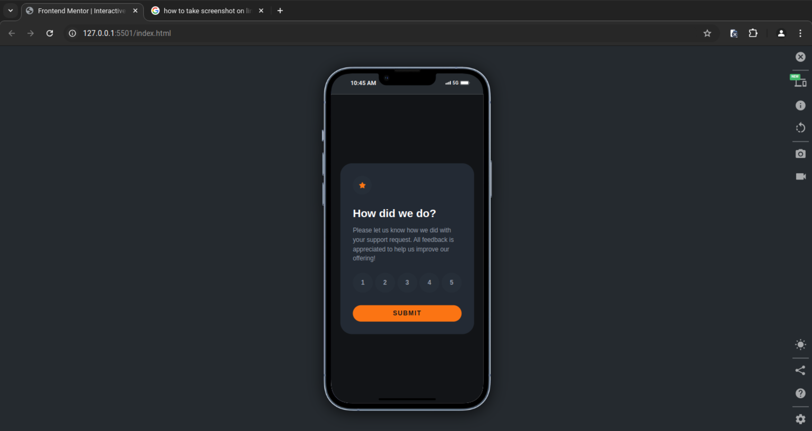
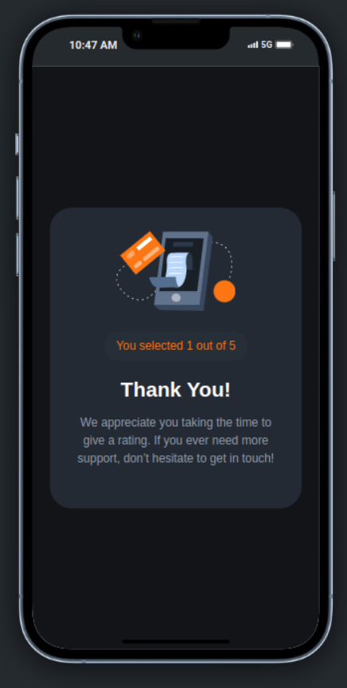
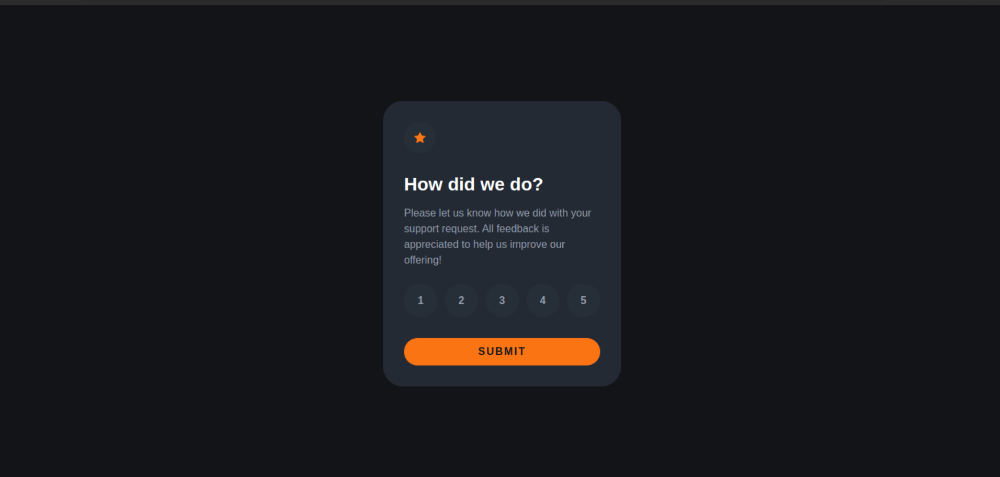
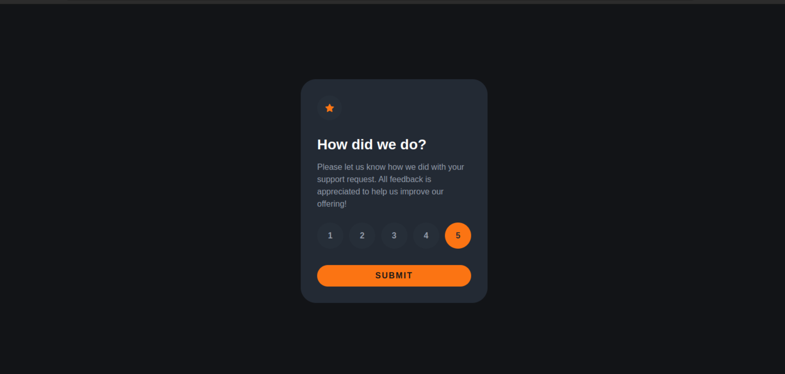
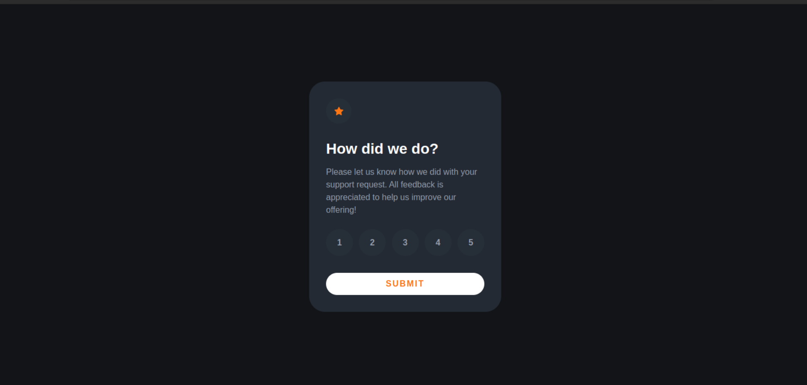

# Frontend Mentor - Interactive rating component solution

## Welcome! 👋

Thanks for checking out this front-end coding challenge.

This is a solution to the [Interactive rating component challenge on Frontend Mentor](https://www.frontendmentor.io/challenges/interactive-rating-component-koxpeBUmI). Frontend Mentor challenges help you improve your coding skills by building realistic projects.

## Table of contents

-   [Overview](#overview)
    -   [The challenge](#the-challenge)
    -   [Screenshot](#screenshot)
    -   [Links](#links)
-   [My process](#my-process)
    -   [Built with](#built-with)
    -   [What I learned](#what-i-learned)
    -   [Continued development](#continued-development)
-   [Author](#author)
-   [Acknowledgments](#acknowledgments)

## Overview

### The challenge

Users should be able to:

-   View the optimal layout for the app depending on their device's screen size
-   See hover states for all interactive elements on the page
-   Select and submit a number rating
-   See the "Thank you" card state after submitting a rating

### Screenshot

-   Mobile Version

-   Mobile submitted version

-   Desktop version

-   Desktop hover state

-   Desktop submitted version

### Links

-   Solution URL: [Add solution URL here](https://your-solution-url.com)
-   Live Site URL: [Add live site URL here](https://your-live-site-url.com)

## My process

### Built with

-   Semantic HTML5 markup
-   CSS custom properties
-   Flexbox
-   CSS Grid
-   Mobile-first workflow

### What I learned

## 1. HTML Structure

-   Creating semantic HTML for better accessibility and structure
-   Using SVG inline for the star icon
-   Structuring the layout for both the rating and thank you states

## 2. CSS Styling

-   Implementing a responsive design that works on both mobile and desktop
-   Creating a dark theme with specific color schemes
-   Styling circular buttons and custom layouts
-   Using flexbox for alignment and spacing
-   Implementing hover and active states for interactive elements

## 3. JavaScript Functionality

-   Handling user interactions with vanilla JavaScript
-   Implementing state management without a framework
-   Toggling between different views (rating and thank you states)
-   Using event delegation for efficient event handling
-   Manipulating the DOM to update content dynamically

## 4. Interactive Component Design

-   Creating an intuitive user interface for rating submission
-   Implementing visual feedback for user actions (button states, transitions)
-   Ensuring a smooth user experience from selection to submission

## 5. SVG and Image Handling

-   Incorporating SVG icons directly in HTML
-   Using external SVG images and handling them responsively

## 6. Accessibility Considerations

-   Ensuring interactive elements are keyboard accessible
-   Using appropriate color contrasts for readability

## 7. Code Organization

-   Separating concerns: HTML for structure, CSS for styling, and JavaScript for behavior
-   Writing clean, readable, and maintainable code

## 8. Problem-Solving

-   Breaking down the design into implementable components
-   Solving layout and interaction challenges with CSS and JavaScript

## 9. Performance Optimization

-   Minimizing DOM manipulations for better performance
-   Using efficient selectors and event listeners

## 10. Cross-Browser Compatibility

-   Ensuring the component works consistently across different browsers
-   Using standard JavaScript methods for wider compatibility

This project provided hands-on experience in creating a fully functional, interactive component using only vanilla web technologies, reinforcing fundamental web development skills and best practices.

### Continued development

# Areas to Focus on in Future Projects

## 1. Advanced JavaScript Concepts

-   Explore more complex state management techniques
-   Dive deeper into ES6+ features and functional programming
-   Learn about performance optimization in JavaScript

## 2. Responsive Design Techniques

-   Practice creating layouts that adapt to various screen sizes
-   Explore CSS Grid for more complex layouts
-   Implement responsive typography and images

## 3. Accessibility (a11y)

-   Learn ARIA roles and attributes for enhanced accessibility
-   Implement keyboard navigation for all interactive elements
-   Test with screen readers and other assistive technologies

## 4. CSS Animations and Transitions

-   Create smooth transitions between component states
-   Implement subtle animations to enhance user experience
-   Explore CSS keyframe animations for more complex effects

## 5. Form Validation and User Input Handling

-   Implement client-side form validation
-   Provide clear and accessible error messages
-   Handle various types of user inputs (text, number, date, etc.)

## 6. API Integration

-   Fetch data from external APIs
-   Implement error handling for network requests
-   Learn about authentication and security best practices

## 7. Performance Optimization

-   Optimize asset loading (images, fonts, scripts)
-   Implement lazy loading for images and components
-   Learn about browser rendering and how to optimize it

## 8. Cross-Browser Compatibility

-   Test and ensure consistency across different browsers
-   Learn about and implement polyfills when necessary
-   Understand and handle browser-specific quirks

## 9. Build Tools and Module Bundlers

-   Explore tools like Webpack, Parcel, or Vite
-   Implement a build process for my projects
-   Learn about code splitting and lazy loading

## 10. Version Control and Collaboration

-   Deepen my understanding of Git
-   Practice branching, merging, and resolving conflicts
-   Collaborate on projects using GitHub or similar platforms

## 11. Testing

-   Learn about unit testing with frameworks like Jest
-   Implement integration tests for your components
-   Explore end-to-end testing with tools like Cypress

## 12. Progressive Enhancement

-   Build projects that work without JavaScript as a baseline
-   Enhance functionality progressively for modern browsers
-   Ensure core functionality is available to all users

By focusing on these areas in my future projects, I'll continue to build on the foundation established with the interactive rating component and expand my skills as a web developer.

## Author

-   Website - [Add your name here](https://www.your-site.com)
-   Frontend Mentor - [@yourusername](https://www.frontendmentor.io/profile/yourusername)
-   Twitter - [@yourusername](https://www.twitter.com/yourusername)
